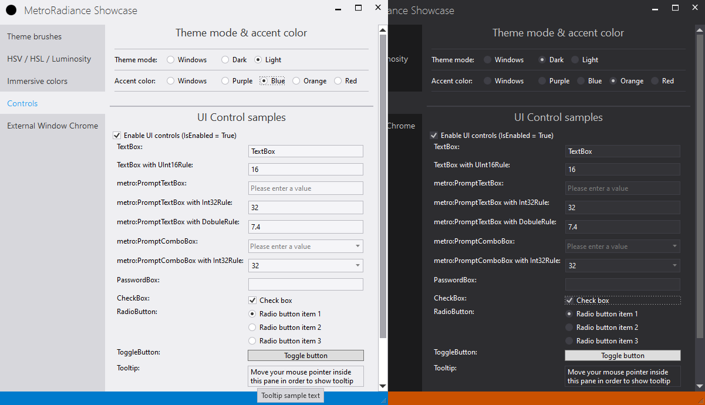
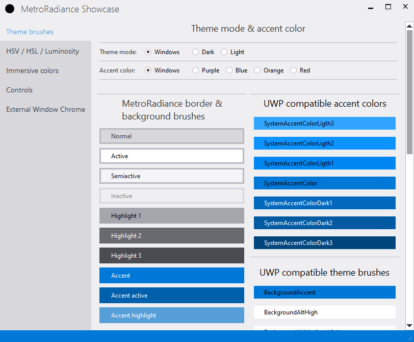
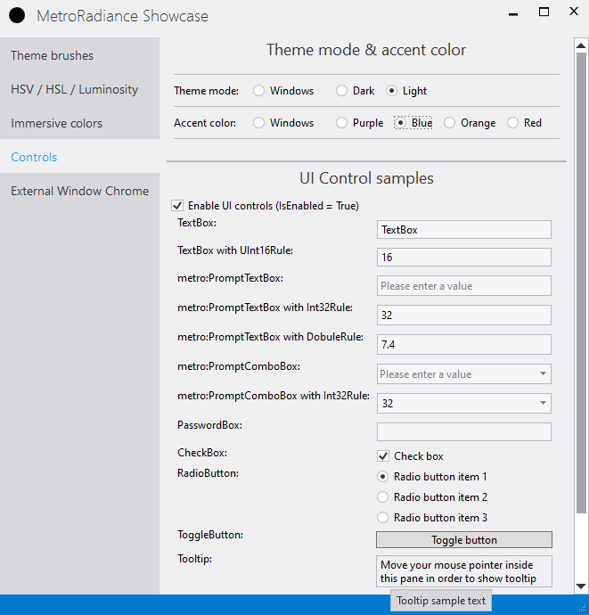
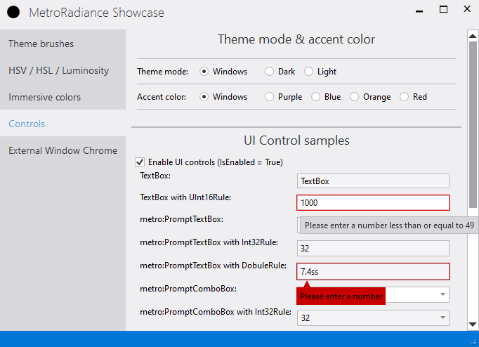

[Click here](https://nishy-software.com/ja/metroradiance-fork/) for Japanese page (日本語ページは[こちら](https://nishy-software.com/ja/metroradiance-fork/))

# MetroRadiance.Fork

MetroRadiance.Fork: [](https://nishy-software.visualstudio.com/MetroRadiance/_build/latest?definitionId=6&branchName=develop)
[](https://nishy-software.visualstudio.com/MetroRadiance/_build/latest?definitionId=6&branchName=master)

[](https://www.nuget.org/packages/MetroRadiance.Fork.Core/)
[](https://www.nuget.org/packages/MetroRadiance.Fork/)
[](https://www.nuget.org/packages/MetroRadiance.Fork/)
[](https://github.com/nishy2000/MetroRadiance.Fork/releases)
[](https://github.com/nishy2000/MetroRadiance.Fork/blob/master/LICENSE.txt)

[](https://github.com/nishy2000/MetroRadiance.Fork/issues)
[](https://github.com/nishy2000/MetroRadiance.Fork/issues?q=is%3Aissue+is%3Aclosed)
[](https://github.com/nishy2000/MetroRadiance.Fork/pulls)
[](https://github.com/nishy2000/MetroRadiance.Fork/pulls?q=is%3Apr+is%3Aclosed)

( MetroRadiance: [)](https://ci.appveyor.com/project/Grabacr07/MetroRadiance)
[](https://www.nuget.org/packages/MetroRadiance.Core/)
[](https://www.nuget.org/packages/MetroRadiance.Core/)
[](https://github.com/Grabacr07/MetroRadiance/blob/master/LICENSE.txt) )

UI control libraries for create WPF window like Visual Studio 2012/2013/2015.
MetroRadiance.Fork is forked of MetroRadiance 2.4.0.



# Installation

Install NuGet package(s).

```powershell
PM> Install-Package MetroRadiance.Fork
```

* [MetroRadiance.Fork.Core](https://www.nuget.org/packages/MetroRadiance.Fork.Core/) - MetroRadiance core library.
* [MetroRadiance.Fork.Chrome](https://www.nuget.org/packages/MetroRadiance.Fork.Chrome/) - Chrome library for WPF Window.
* [MetroRadiance.Fork](https://www.nuget.org/packages/MetroRadiance.Fork/) - WPF custom control library.


# Features / How to use

## MetroRadiance.Core

### [v3.0.0-] DPI / Per-Monitor DPI support
  - Get system DPI
  - Get monitor DPI from monitor handle
  - Get window DPI from [Visual](https://docs.microsoft.com/en-us/dotnet/api/system.windows.media.visual)
  - Get window DPI from [HwndSource](https://docs.microsoft.com/en-us/dotnet/api/system.windows.interop.hwndsource) or window handle

```csharp
using MetroRadiance.Platform;
```

```csharp
// Get system dpi.
var systemDpi = DpiHelper.GetDpiForSystem();

// Get monitor dpi.
var monitorDpi = DpiHelper.GetDpiForMonitor(hMonitor);

// Get window dpi from HwndSource.
var hwndSource = (HwndSource)PresentationSource.FromVisual(this);
var windowDpi = hwndSource.GetDpi();

// Get window dpi from window handle.
var windowDpi = DpiHelper.GetDpiForWindow(hWnd);
```

### Windows theme support
  - Get Windows app theme (`WindowsTheme.Theme`, Light or Dark, only Windows 10)
  - Get Windows system theme (`WindowsTheme.SystemTheme`, Light or Dark, only Windows 10)
  - Get Windows accent color (`WindowsTheme.Accent`)
  - Get Windows highContrast mode (`WindowsTheme.HighContrast`)
  - Get Windows color prevalence (`WindowsTheme.ColorPrevalence`)
  - Get Windows transparency (`WindowsTheme.Transparency`)
  - [v3.0.0-] Get Windows text scale factor (`WindowsTheme.TextScaleFactor`)
  - Subscribe theme property change event from Windows

```csharp
using MetroRadiance.Platform;
```

```csharp
// Get Windows accent color
var color = WindowsTheme.Accent.Current;

// Subscribe accent color change event from Windows theme.
var disposable = WindowsTheme.Accent.RegisterListener(color =>
{
    // apply color to your app.
});

// Unsubscribe color change event.
disposable.Dispose();
```

### HSV/HSL color model and Luminosity support

```csharp
using MetroRadiance.Media;
```

```csharp
// Get Windows accent color (using MetroRadiance.Platform;)
var rgbColor = WindowsTheme.Accent.Current;

// Convert from RGB to HSV color.
var hsvColor = rgbColor.ToHsv();
hsvColor.V *= 0.8;

// Convert from HSV to RGB color.
var newColor1 = hsvColor.ToRgb();

// [v3.0.0-] Convert from RGB to HSL color.
var hslColor = rgbColor.ToHsv();
hslColor.L *= 0.8;

// [v3.0.0-] Convert from HSL to RGB color.
var newColor2 = hslColor.ToRgb();

// Calculate luminosity from RGB color.
var luminosity = Luminosity.FromRgb(rgbColor);
```

## MetroRadiance.Chrome

### Add window chrome like Visual Studio to WPF Window
  - `MetroRadiance.Chrome.WindowChrome`

```xml
<Window xmlns:chrome="http://schemes.grabacr.net/winfx/2014/chrome">
    <chrome:WindowChrome.Instance>
        <chrome:WindowChrome />
    </chrome:WindowChrome.Instance>
</Window>
```

### Add any UI elements to window chrome
  - `MetroRadiance.Chrome.WindowChrome.Top` / `.Left` / `.Right` / `.Bottom`

```xml
<Window xmlns:chrome="http://schemes.grabacr.net/winfx/2014/chrome">
    <chrome:WindowChrome.Instance>
        <chrome:WindowChrome>
            <chrome:WindowChrome.Top>
                <Border Background="DarkRed"
                        Padding="24,3"
                        Margin="8,0"
                        HorizontalAlignment="Right">
                    <TextBlock Text="any UI elements"
                               Foreground="White" />
                </Border>
            </chrome:WindowChrome.Top>
        </chrome:WindowChrome>
    </chrome:WindowChrome.Instance>
</Window>
```


## MetroRadiance

### Theme support

```csharp
// Change theme.
ThemeService.Current.ChangeTheme(Theme.Dark);

// Change theme (sync Windows)
ThemeService.Current.ChangeTheme(Theme.Windows);

// Change Accent
ThemeService.Current.ChangeAccent(Accent.Blue);

// Change accent (sync Windows)
ThemeService.Current.ChangeAccent(Accent.Windows);

// Change accent (from RGB Color)
var accent = Colors.Red.ToAccent();
ThemeService.Current.ChangeAccent(accent);
```

### [v3.0.0-] UWP compatible Color and Brush resources defined in MetroRadiance

MetroRadiance defines UWP compatible Color and Brush resources.
Naming rule is [here (Microsoft site)](https://docs.microsoft.com/en-us/windows/uwp/design/controls-and-patterns/xaml-theme-resources#the-xaml-color-ramp-and-theme-dependent-brushes)

You can not use these as `ThemeResource` in WPF.
If you use these as `DynamicResource` in your controls, the control will work with the theme color.

These resources are enabled by the followings.

- Define in WPF XAML (App.xaml.cs)

  App enables UWP resources using `EnableUwpResoruces()` before calling `Register()`. This method enables UWP resources for the entire app.
  ```csharp
    using MetroRadiance.UI;
    
    public partial class App : Application
    {
        protected override void OnStartup(StartupEventArgs e)
        {
            base.OnStartup(e);
            ThemeService.Current.EnableUwpResoruces();
            ThemeService.Current.Register(this, Theme.Windows, Accent.Windows);
            ...
  ```

- Define in WPF XAML (not App.xaml)

  This method enables UWP resources only for the specified object (Window/Control/etc).
  - Enable HasThemeResource using `ThemeHelper.HasThemeResources="True"` for Window/Control/etc
  - Merge at least one UWP resource (.../Themes/UWP/....xaml) defined in MetroRadiance component

  ```xml
  <UserControl x:Class="MetroRadiance.Showcase.UI.UwpBrushSamples"
    ...
    xmlns:metro="http://schemes.grabacr.net/winfx/2014/controls"
    metro:ThemeHelper.HasThemeResources="True">

    <UserControl.Resources>
        <ResourceDictionary>
            <ResourceDictionary.MergedDictionaries>
                <ResourceDictionary Source="pack://application:,,,/MetroRadiance;component/Themes/UWP/Dark.xaml" />
            </ResourceDictionary.MergedDictionaries>
    ...
  ```
UWP resoruce files defined in MetroRadiance component
- `/Themes/UWP/Light.xaml`
- `/Themes/UWP/Dark.xaml`
- `/Themes/UWP/HighContrast.xaml`
- `/Themes/UWP/Accents/Blue.xaml`
- `/Themes/UWP/Accents/Orange.xaml`
- `/Themes/UWP/Accents/Purple.xaml`

Your app can reference using the prefix: `"pack://application:,,,/MetroRadiance;component/"`.



### Custom Color and Brush resources defined in MetroRadiance

MetroRadiance defines custom Color and Brush resources.
Naming rule is `[ColorName]ColorKey` and `[ColorName]BrushKey`.

You can not use these as `ThemeResource` in WPF.
If you use these as `DynamicResource` in your controls, the control will work with the theme color.

These resources are enabled by the followings.

- Define in WPF XAML (App.xaml.cs)

  App enables the custom color and brush resources using `Register()`. This method enables custom resources for the entire app.
  ```csharp
    using MetroRadiance.UI;
    
    public partial class App : Application
    {
        protected override void OnStartup(StartupEventArgs e)
        {
            base.OnStartup(e);
            ThemeService.Current.Register(this, Theme.Windows, Accent.Windows);
            ...
  ```

- Define in WPF XAML (not App.xaml)

  This method enables custom resources only for the specified object (Window/Control/etc).
  - Enable HasThemeResource using `ThemeHelper.HasThemeResources="True"` for Window/Control/etc

  ```xml
  <UserControl x:Class="MetroRadiance.Showcase.UI.BrushSamples"
    ...
    xmlns:metro="http://schemes.grabacr.net/winfx/2014/controls"
    metro:ThemeHelper.HasThemeResources="True">
    ...
  ```
Custom resoruce files defined in MetroRadiance component
- `/Themes/Light.xaml`
- `/Themes/Dark.xaml`
- `/Themes/Accents/Blue.xaml`
- `/Themes/Accents/Orange.xaml`
- `/Themes/Accents/Purple.xaml`

Your app can reference using the prefix: `"pack://application:,,,/MetroRadiance;component/"`.

Table: Theme Color

|Color Name |Sample| Color Key | Brush Key|
|---|---|---|---|
|Theme|<span style="background:#EFEFF2">Light</span>/<span style="background:#2D2D30">Dark</span>|ThemeColorKey|ThemeBrushKey|
|Background|<span style="background:#D7D7DC">Light</span>/<span style="background:#1B1B1C">Dark</span>|BackgroundColorKey|BackgroundBrushKey|
|Border|<span style="background:#B9B9C0">Light</span>/<span style="background:#3F3F46">Dark</span>|BorderColorKey|BorderBrushKey|
|Foreground|<span style="background:#363636">Light</span>/<span style="background:#C8C8C8">Dark</span>|ForegroundColorKey|ForegroundBrushKey|
|SemiactiveBackground|<span style="background:#F5F5F8">Light</span>/<span style="background:#333337">Dark</span>|SemiactiveBackgroundColorKey|SemiactiveBackgroundBrushKey|
|SemiactiveBorder|<span style="background:#B9B9C0">Light</span>/<span style="background:#3F3F46">Dark</span>|SemiactiveBorderColorKey|SemiactiveBorderBrushKey|
|SemiActiveForeground|<span style="background:#101010">Light</span>/<span style="background:#A1A0A0">Dark</span>|SemiActiveForegroundColorKey|SemiActiveForegroundBrushKey|
|ActiveBackground|<span style="background:#FFFFFF">Light</span>/<span style="background:#3F3F46">Dark</span>|ActiveBackgroundColorKey|ActiveBackgroundBrushKey|
|ActiveBorder|<span style="background:#B9B9C0">Light</span>/<span style="background:#3F3F46">Dark</span>|ActiveBorderColorKey|ActiveBorderBrushKey|
|ActiveForeground|<span style="background:#000000">Light</span>/<span style="background:White">Dark</span>|ActiveForegroundColorKey|ActiveForegroundBrushKey|
|InactiveBackground|<span style="background:#EFEFF2">Light</span>/<span style="background:#2D2D30">Dark</span>|InactiveBackgroundColorKey|InactiveBackgroundBrushKey|
|InactiveBorder|<span style="background:#D7D7DE">Light</span>/<span style="background:#3C3C41">Dark</span>|InactiveBorderColorKey|InactiveBorderBrushKey|
|InactiveForeground|<span style="background:#808080">Light</span>/<span style="background:#787878">Dark</span>|InactiveForegroundColorKey|InactiveForegroundBrushKey|
|HighlightBackground|<span style="background:#A5A5AC">Light</span>/<span style="background:#686868">Dark</span>|HighlightBackgroundColorKey|HighlightBackgroundBrushKey|
|HighlightBorder|<span style="background:#A5A5AC">Light</span>/<span style="background:#686868">Dark</span>|HighlightBorderColorKey|HighlightBorderBrushKey|
|HighlightForeground|<span style="background:#000000">Light</span>/<span style="background:#FFFFFF">Dark</span>|HighlightForegroundColorKey|HighlightForegroundBrushKey|
|Highlight2Background|<span style="background:#696970">Light</span>/<span style="background:#A0A0A0">Dark</span>|Highlight2BackgroundColorKey|Highlight2BackgroundBrushKey|
|Highlight2Border|<span style="background:#696970">Light</span>/<span style="background:#A0A0A0">Dark</span>|Highlight2BorderColorKey|Highlight2BorderBrushKey|
|Highlight2Foreground|<span style="background:#FFFFFF">Light</span>/<span style="background:#000000">Dark</span>|Highlight2ForegroundColorKey|Highlight2ForegroundBrushKey|
|Highlight3Background|<span style="background:#4B4B52">Light</span>/<span style="background:#C8C8C8">Dark</span>|Highlight3BackgroundColorKey|Highlight3BackgroundBrushKey|
|Highlight3Border|<span style="background:#4B4B52">Light</span>/<span style="background:#C8C8C8">Dark</span>|Highlight3BorderColorKey|Highlight3BorderBrushKey|
|Highlight3Foreground|<span style="background:#FFFFFF">Light</span>/<span style="background:#000000">Dark</span>|Highlight3ForegroundColorKey|Highlight3ForegroundBrushKey|
|LinkForeground|<span style="background:#0000C8">Light</span>/<span style="background:#7AC1FF">Dark</span>|LinkForegroundColorKey|LinkForegroundBrushKey|
|ActiveLinkForeground|<span style="background:#007ACC">Light</span>/<span style="background:#007ACC">Dark</span>|ActiveLinkForegroundColorKey|ActiveLinkForegroundBrushKey|
|ValidationError|<span style="background:#C80000">Light</span>/<span style="background:#C80000">Dark</span>|ValidationErrorColorKey|ValidationErrorBrushKey|


Table: Accent Color
|Color Name |Sample| Color Key | Brush Key|
|---|---|---|---|
|Accent|<span style="background:#007ACC">Blue</span>/<span style="background:#CA5100">Orange</span>/<span style="background:#68217A">Purple</span>|AccentColorKey|AccentBrushKey|
|AccentHighlight|<span style="background:#28A0F0">Blue</span>/<span style="background:#F07828">Orange</span>/<span style="background:#8C46A0">Purple</span>|AccentHighlightColorKey|AccentHighlightBrushKey|
|AccentActive|<span style="background:#005AAA">Blue</span>/<span style="background:#B43C00">Orange</span>/<span style="background:#5A1464">Purple</span>|AccentActiveColorKey|AccentActiveBrushKey|
|AccentForeground|<span style="background:White">Blue</span>/<span style="background:White">Orange</span>/<span style="background:White">Purple</span>|AccentForegroundColorKey|AccentForegroundBrushKey|

Style definition sample
```xml
<Style TargetType="{x:Type Button}">
    <Setter Property="Background"
            Value="{DynamicResource BackgroundBrushKey}" />
    <Setter Property="BorderBrush"
            Value="{DynamicResource BorderBrushKey}" />
    <Setter Property="Foreground"
            Value="{DynamicResource ActiveForegroundBrushKey}" />
    <Setter Property="BorderThickness"
            Value=".99" />
    <Setter Property="Padding"
            Value="8,2" />
    <Setter Property="FocusVisualStyle"
            Value="{DynamicResource {x:Static SystemParameters.FocusVisualStyleKey}}" />
    <Setter Property="Template">
        <Setter.Value>
            <ControlTemplate TargetType="{x:Type Button}">
                <Border BorderBrush="{TemplateBinding BorderBrush}"
                        BorderThickness="{TemplateBinding BorderThickness}"
                        SnapsToDevicePixels="{TemplateBinding SnapsToDevicePixels}"
                        Background="{TemplateBinding Background}">
                    <ContentPresenter x:Name="contentPresenter"
                                        Margin="{TemplateBinding Padding}"
                                        HorizontalAlignment="{TemplateBinding HorizontalContentAlignment}"
                                        VerticalAlignment="{TemplateBinding VerticalContentAlignment}" />
                </Border>
            </ControlTemplate>
        </Setter.Value>
    </Setter>
    <Style.Triggers>
        <Trigger Property="IsMouseOver"
                    Value="True">
            <Setter Property="Background"
                    Value="{DynamicResource ActiveBackgroundBrushKey}" />
            <Setter Property="BorderBrush"
                    Value="{DynamicResource ActiveBorderBrushKey}" />
        </Trigger>
        <Trigger Property="IsPressed"
                    Value="True">
            <Setter Property="Background"
                    Value="{DynamicResource AccentBrushKey}" />
            <Setter Property="BorderBrush"
                    Value="{DynamicResource ActiveBorderBrushKey}" />
            <Setter Property="Foreground"
                    Value="{DynamicResource AccentForegroundBrushKey}" />
        </Trigger>
        <Trigger Property="IsEnabled"
                    Value="False">
            <Setter Property="Background"
                    Value="{DynamicResource InactiveBackgroundBrushKey}" />
            <Setter Property="BorderBrush"
                    Value="{DynamicResource InactiveBorderBrushKey}" />
            <Setter Property="Foreground"
                    Value="{DynamicResource InactiveForegroundBrushKey}" />
        </Trigger>
    </Style.Triggers>
</Style>
```

### Standard control styles

You can use the standard control styles by merging "/Styles/Controls.xaml" of MetroRadiance into ```Application.Resource``` etc.
These styles use the colors and brushes defined in MetroRadiance. Therefore, it will be linked to the theme change and color setting change.

```xml
<Application x:Class="MetroRadiance.Showcase.App"
			 xmlns="http://schemas.microsoft.com/winfx/2006/xaml/presentation"
			 xmlns:x="http://schemas.microsoft.com/winfx/2006/xaml"
			 StartupUri="UI/MainWindow.xaml">
	<Application.Resources>
		<ResourceDictionary>
			<ResourceDictionary.MergedDictionaries>
				<ResourceDictionary Source="pack://application:,,,/MetroRadiance;component/Styles/Controls.xaml" />
				<ResourceDictionary Source="pack://application:,,,/MetroRadiance;component/Themes/Dark.xaml" />
				<ResourceDictionary Source="pack://application:,,,/MetroRadiance;component/Themes/Accents/Blue.xaml" />
			</ResourceDictionary.MergedDictionaries>
		</ResourceDictionary>
	</Application.Resources>
</Application>
```

Styles are defined by "/Styles/Controls.xaml"
 - `<Style TargetType="{x:Type Button}">`
 - `<Style x:Key="CircleButtonStyleKey" TargetType="{x:Type Button}">`
 - `<Style TargetType="{x:Type CheckBox}">`
 - [v3.0.0-] `<Style TargetType="{x:Type ContextMenu}">`
 - `<Style TargetType="{x:Type Expander}">`
 - `<Style x:Key="{x:Static SystemParameters.FocusVisualStyleKey}">`
 - [v3.0.0-] `<Style TargetType="{x:Type Label}">`
 - [v3.0.0-] `<Style TargetType="{x:Type Menu}">`
 - [v3.0.0-] `<Style TargetType="{x:Type MenuItem}">`
 - `<Style TargetType="{x:Type PasswordBox}">`
 - `<Style TargetType="{x:Type RadioButton}">`
 - `<Style TargetType="{x:Type ScrollBar}">`
 - [v3.0.0-] `<Style TargetType="{x:Type TextBox}">`
 - `<Style TargetType="{x:Type ToggleButton}">`
 - `<Style TargetType="{x:Type ToolTip}">`



### Custom controls
- [v3.0.0-] AcrylicBlurWindow
- Badge
- BindableRichTextBox
- BindableTextBlock
- BlurWindow
- CaptionButton
- CaptionIcon
- ExpanderButton
- LinkButton
- MetroWindow
- ProgressRing
- PromptComboBox
- PromptTextBox
- ResizeGrip
- SystemButtons
- TabView

### Custom converters
- WindowStateToVisibilityConverter

### Custom validation rules
#### NumberRule
- [v3.0.0-] Int16Rule
- [v3.0.0-] UInt16Rule
- Int32Rule
- [v3.0.0-] UInt32Rule
- [v3.0.0-] Int64Rule
- [v3.0.0-] UInt64Rule
- [v3.0.0-] SingleRule
- [v3.0.0-] DoubleRule

Example for TextBox using UInt16Rule (ushort)
```xml
<TextBox xmlns:metro="http://schemes.grabacr.net/winfx/2014/controls">
    <TextBox.Text>
        <Binding Path="UInt16"
                 UpdateSourceTrigger="PropertyChanged">
            <Binding.ValidationRules>
                <metro:UInt16Rule Min="1"
                                  Max="49" />
            </Binding.ValidationRules>
        </Binding>
    </TextBox.Text>
</TextBox>
```

Example for TextBox using DoubleRule (dobule).
If you want to use PropertyChanged as UpdateSourceTrigger for DoubleRule and SingleRule, you need to use `FrameworkCompatibilityPreferences.KeepTextBoxDisplaySynchronizedWithTextProperty = false;`
```xml
<TextBox xmlns:metro="http://schemes.grabacr.net/winfx/2014/controls">
    <TextBox.Text>
        <Binding Path="Double"
                 UpdateSourceTrigger="LostFocus">
            <Binding.ValidationRules>
                <metro:Int32Rule Min="-4.9"
                                 Max="9.9" />
            </Binding.ValidationRules>
        </Binding>
    </TextBox.Text>
</TextBox>
```

Example for TextBox using UInt16Rule (ushort) and a tooltip display of errors
```xml
<TextBox xmlns:metro="http://schemes.grabacr.net/winfx/2014/controls">
    <TextBox.Text>
        <Binding Path="UInt16"
                 UpdateSourceTrigger="PropertyChanged">
            <Binding.ValidationRules>
                <metro:Int32Rule Min="1"
                                 Max="49" />
            </Binding.ValidationRules>
        </Binding>
    </TextBox.Text>
    <TextBox.Style>
        <Style TargetType="TextBox" BasedOn="{StaticResource {x:Type TextBox}}">
            <Style.Triggers>
                <Trigger Property="Validation.HasError"
                         Value="True">
                    <Setter Property="ToolTip">
                        <Setter.Value>
                            <Binding 
                                Path="(Validation.Errors)[0].ErrorContent"
                                RelativeSource="{x:Static RelativeSource.Self}" />
                        </Setter.Value>
                    </Setter>
                </Trigger>
            </Style.Triggers>
        </Style>
    </TextBox.Style>
</TextBox>
```
Example for metro:PromptTextBox using Int32Rule (int)
```xml
<metro:PromptTextBox xmlns:metro="http://schemes.grabacr.net/winfx/2014/controls">
    <metro:PromptTextBox.Text>
        <Binding Path="Int32"
  UpdateSourceTrigger="PropertyChanged">
            <Binding.ValidationRules>
                <metro:Int32Rule Min="-4"
                                 Max="49" />
            </Binding.ValidationRules>
        </Binding>
    </metro:PromptTextBox.Text>
</metro:PromptTextBox>
```


### Custom behaviors


## License

This library is under [the MIT License (MIT)](LICENSE.txt).
